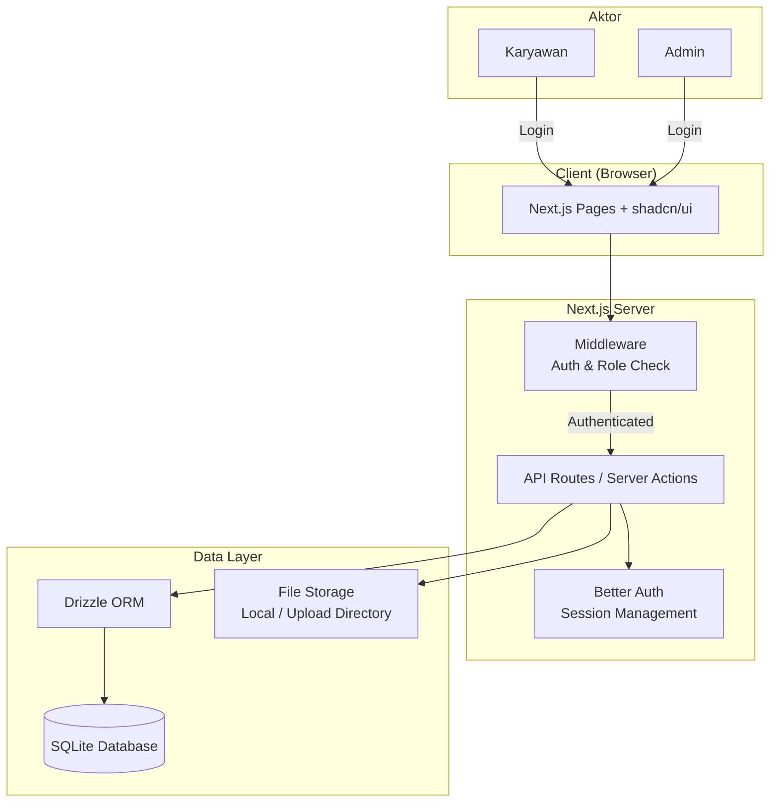
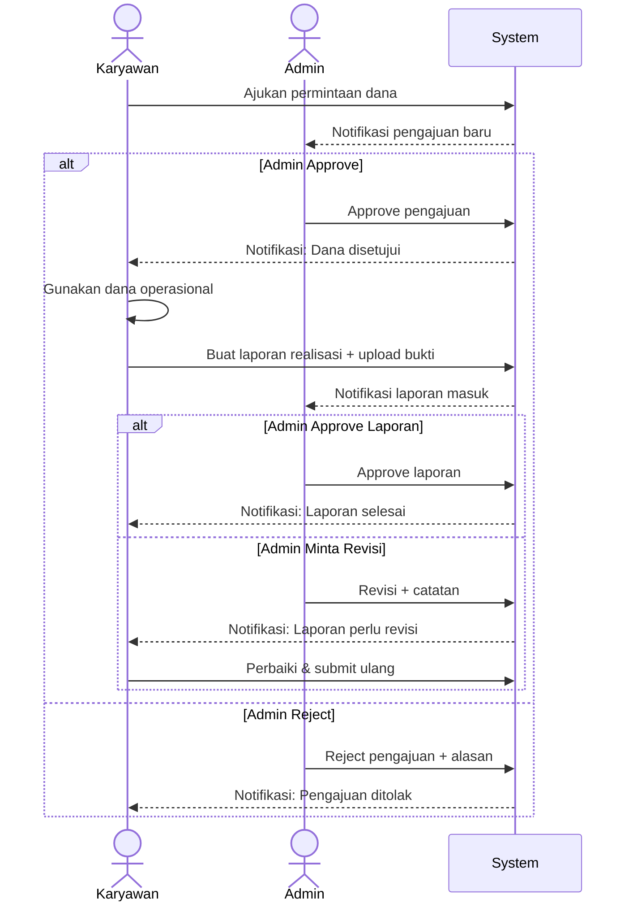
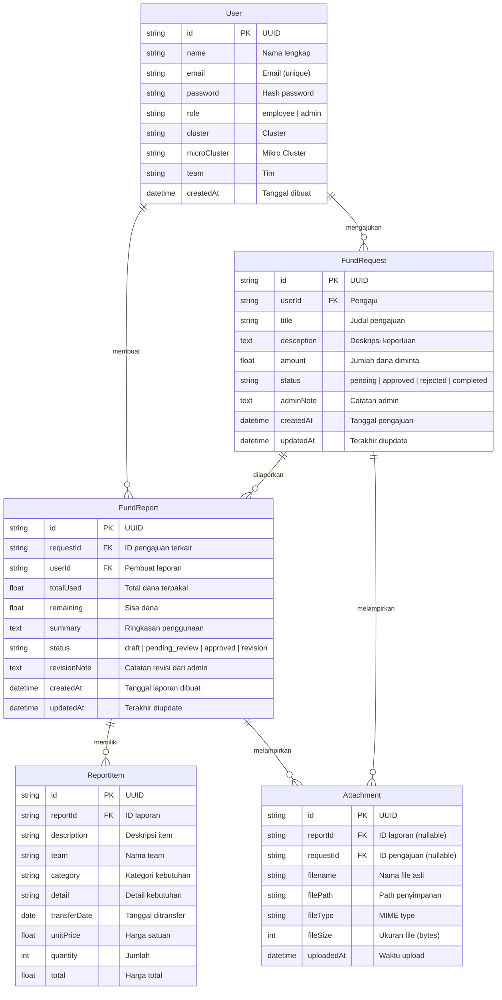

# PRD — Project Requirements Document

## 1. Overview

Aplikasi web internal untuk mempermudah 100 karyawan dalam mengajukan permintaan dana operasional serta membuat pelaporan realisasi dana secara rinci. Saat ini proses masih manual (form kertas/chat/email), sehingga menyulitkan tracking, memperlambat approval, dan meningkatkan risiko kehilangan data pelaporan.

**Tujuan utama:**
- Menyediakan alur pengajuan dan approval dana yang terstruktur dan transparan.
- Memastikan setiap dana yang dicairkan memiliki laporan pertanggungjawaban yang rinci disertai bukti/nota.
- Memudahkan admin dalam mengelola, menyetujui, dan mengaudit seluruh permintaan dan laporan.

## 2. Requirements

### Fungsional
- **Autentikasi:** Login menggunakan email/password untuk karyawan dan admin.
- **Role-based access:** Dua role — `employee` (karyawan) dan `admin`.
- **Profil karyawan:** Setiap karyawan memiliki informasi cluster, mikro cluster, dan tim.
- **Pengajuan dana:** Karyawan dapat membuat, mengedit (selama belum direview), dan membatalkan pengajuan.
- **Approval pengajuan:** Admin dapat menyetujui atau menolak pengajuan disertai catatan.
- **Pelaporan realisasi:** Karyawan membuat laporan penggunaan dana yang sudah disetujui — mencakup rincian item pengeluaran dan upload bukti/nota.
- **Review laporan:** Admin dapat menyetujui laporan atau meminta revisi.
- **Riwayat & status tracking:** Semua transaksi memiliki status yang dapat dilacak (pending/approved/rejected/reported/completed).
- **Upload file:** Dukungan upload bukti/nota dalam format gambar (JPG, PNG) atau PDF dengan batas maksimal ukuran file **10MB**.

### Non-Fungsional
- **Skala:** Mendukung ~100 karyawan aktif.
- **Responsif:** Dapat diakses dari desktop dan mobile browser.
- **Keamanan:** Middleware proteksi route berdasarkan role; file hanya dapat diakses oleh pemilik dan admin.
- **Kecepatan:** Halaman utama dimuat dalam < 2 detik.

## 3. Core Features

### Untuk Karyawan
- **Dashboard karyawan** — melihat ringkasan pengajuan aktif, yang sudah disetujui, dan laporan yang perlu dibuat.
- **Profil karyawan** — menampilkan informasi cluster, mikro cluster, dan tim.
- **Form pengajuan dana** — judul, deskripsi keperluan, jumlah dana yang diminta, rincian estimasi penggunaan.
- **Riwayat pengajuan** — daftar seluruh pengajuan beserta status terkini.
- **Form laporan realisasi** — diisi setelah dana digunakan: ringkasan penggunaan, rincian item per item (deskripsi, team, kategori kebutuhan, detail kebutuhan, tanggal ditransfer, harga satuan, jumlah, harga total), upload bukti/nota per item.
- **Notifikasi** — pemberitahuan saat pengajuan disetujui/ditolak atau laporan diminta revisi.

### Untuk Admin
- **Dashboard admin** — ringkasan pengajuan masuk, laporan masuk, dan statistik bulanan.
- **Daftar pengajuan** — list seluruh pengajuan karyawan dengan filter status, cluster, mikro cluster, tim, dan pencarian.
- **Detail & approval pengajuan** — melihat detail pengajuan beserta profil karyawan (cluster, mikro cluster, tim), menyetujui/menolak dengan catatan.
- **Daftar laporan** — list laporan realisasi yang masuk, filter status.
- **Review laporan** — memeriksa rincian laporan dan bukti/nota, menyetujui atau meminta revisi.
- **Manajemen pengguna** — menambah/menonaktifkan akun karyawan, mengelola data cluster, mikro cluster, dan tim.

## 4. User Flow

### Alur Pengajuan Dana
1. **Karyawan login** → masuk ke dashboard karyawan.
2. Klik **"Ajukan Dana"** → mengisi form: judul, deskripsi keperluan, jumlah dana, rincian estimasi.
3. Submit → pengajuan berstatus **"Pending"**.
4. **Admin login** → melihat notifikasi pengajuan baru di dashboard.
5. Admin membuka detail pengajuan (dapat melihat cluster, mikro cluster, tim pengaju) → **Approve** atau **Reject** dengan catatan opsional.
6. Status berubah: **"Approved"** (dana dapat dicairkan) atau **"Rejected"** (selesai).

### Alur Pelaporan Dana
1. Karyawan melihat pengajuan yang sudah **"Approved"** → klik **"Buat Laporan"**.
2. Mengisi form laporan: ringkasan penggunaan, item-item pengeluaran (deskripsi, team, kategori kebutuhan, detail kebutuhan, tanggal ditransfer, harga satuan, jumlah, harga total).
3. Upload bukti/nota untuk setiap item atau laporan secara keseluruhan (maks. **10MB** per file).
4. Submit → laporan berstatus **"Pending Review"**.
5. **Admin login** → melihat laporan masuk → periksa rincian dan bukti.
6. Admin dapat:
   - **Approve** → laporan selesai, status pengajuan menjadi **"Completed"**.
   - **Revisi** → laporan dikembalikan ke karyawan dengan catatan untuk diperbaiki.
7. Jika revisi, karyawan memperbaiki laporan → submit ulang → kembali ke langkah 5.

## 5. Architecture

### Flow Persetujuan & Pelaporan

## 6. Database Schema

### Penjelasan Tabel

| Tabel | Kegunaan |
|---|---|
| **User** | Menyimpan data akun karyawan dan admin. Role menentukan hak akses. Dilengkapi **cluster**, **mikro cluster**, dan **tim** untuk pengelompokan organisasi. |
| **FundRequest** | Setiap pengajuan dana yang dibuat karyawan. Status mencerminkan tahap persetujuan. |
| **FundReport** | Laporan realisasi dana setelah pengajuan disetujui. Terkait satu FundRequest. |
| **ReportItem** | Rincian item pengeluaran dalam satu laporan — deskripsi, team, kategori kebutuhan, detail kebutuhan, tanggal ditransfer, harga satuan, jumlah, harga total. |
| **Attachment** | File bukti/nota yang diupload. Bisa terkait laporan (`reportId`) atau pengajuan (`requestId`). |

## 7. Tech Stack

| Layer | Teknologi | Alasan |
|---|---|---|
| **Framework** | Next.js 15 (App Router) | Full-stack React, SSR, Server Actions — satu codebase untuk frontend & backend. |
| **Styling** | Tailwind CSS | Utility-first, cepat dalam prototyping dan konsisten. |
| **UI Components** | shadcn/ui | Komponen aksesibel berbasis Radix, mudah dikustomisasi, cocok dengan Tailwind. |
| **ORM** | Drizzle ORM | Type-safe, ringan, dan terintegrasi baik dengan SQLite dan Next.js. |
| **Database** | SQLite (via Turso atau lokal) | Cukup untuk skala 100 karyawan; setup minimal, performa baik untuk beban internal. |
| **Autentikasi** | Better Auth | Mendukung email/password, session management, dan middleware Next.js secara native. |
| **File Upload** | Server-side upload (lokal) | Simpan file bukti di filesystem server atau object storage sederhana. Validasi ukuran maksimal **10MB** per file, format: JPG, PNG, PDF. |
| **Deployment** | VPS sederhana atau Railway/Vercel | Fleksibel sesuai preferensi; SQLite mudah di-deploy tanpa server database terpisah. |

---

*Dokumen ini bersifat high-level dan dapat disesuaikan lebih lanjut saat memasuki tahap development.*